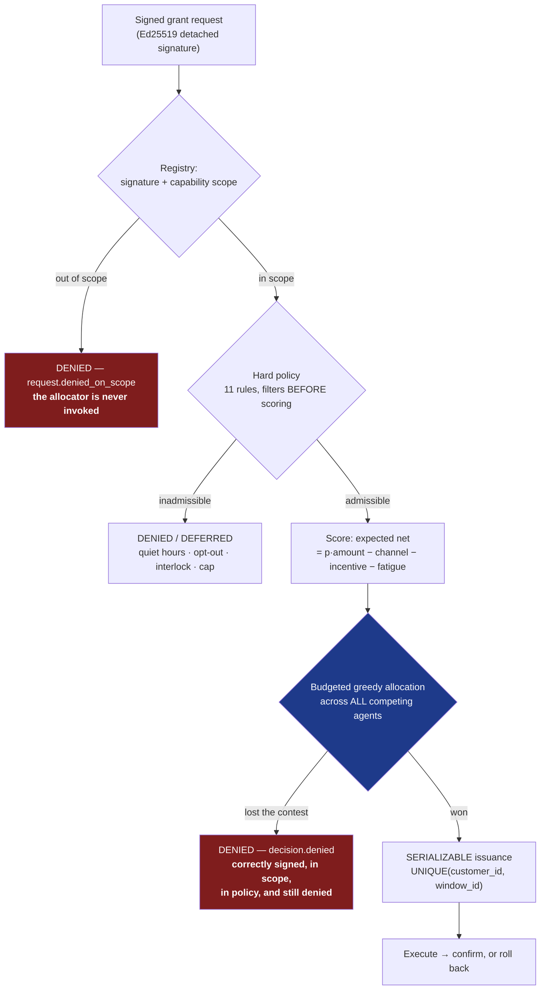
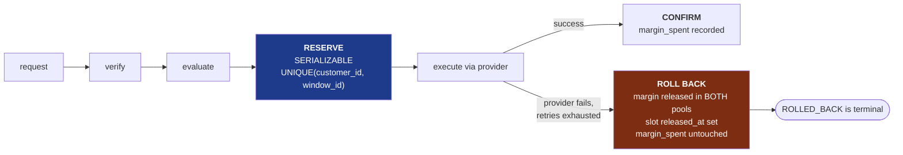
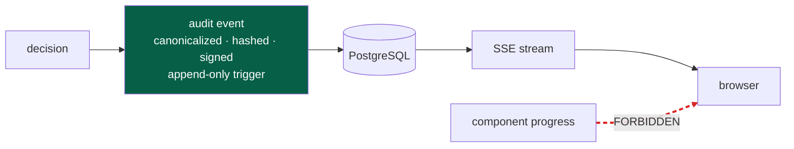
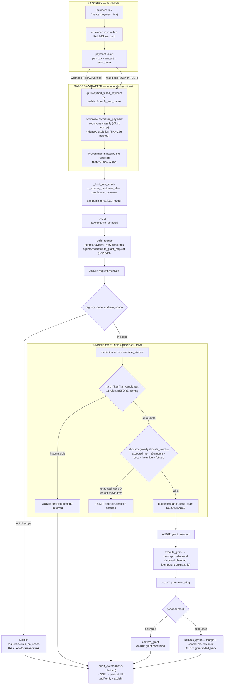
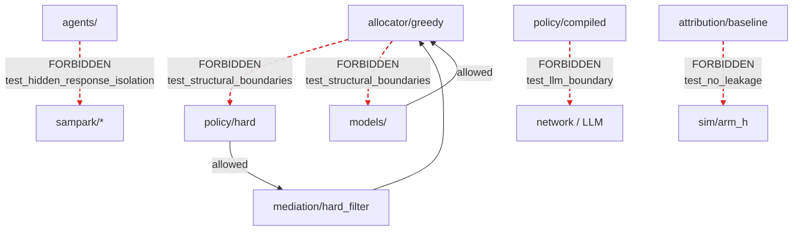

# SAMPARK — Architecture

*A mediation layer for revenue-recovery agents.*

This document explains the system as it is actually built. Every claim points at
a file you can open. Where a number appears, it comes from a committed file
under `results/`, and the filename is given.

Companion documents: [`README.md`](README.md) (what it is, how to run it),
[`DISCLAIMER.md`](DISCLAIMER.md) (what it cannot honestly claim),
[`DECISIONS.md`](DECISIONS.md) (what broke during the build and what was done).

---

## 1. Problem and system boundary

### The thesis

> **Authorization decides whether an agent *may* act.
> Authorization alone must not decide which of several equally-authorized agents *should* act.**

A merchant runs four recovery agents. All four notice that Priya's payment
failed. All four hold valid consent, an approved scope, an in-policy discount
and a registered template. A permission system evaluates one request at a time
and is stateless with respect to the others — that is exactly what makes it fast
and composable, and exactly what makes it blind here. It permits all four calls.

**Every harmful action in the failure catalogue is authorized.** The harm is
emergent: it is a property of the *composition*, and no per-request authorizer
can express it, because the cost of burning a customer falls on whichever agent
needs that customer next week.

SAMPARK is the layer that can express it, because it is the only component that
sees every agent's demand on the same human at the same time.

### Boundary

**Inside:** agent identity and capability scopes; a unified at-risk ledger;
contact and margin budgets; hard-policy enforcement; interlocks; allocation;
transactional grant issuance; attribution; a hash-chained audit log; a live
trace UI.

**Deliberately mocked, and why:** WhatsApp / SMS / voice delivery. You cannot
lawfully contact real phone numbers on synthetic consent. `agents/channel.py`
logs the exact payload that *would* have been sent.

**Deliberately outside:** OAuth/OIDC federation, multi-tenancy, billing,
authentication on the demo, real payment movement (Razorpay integration is
`rzp_test_` only), and cross-merchant fatigue.

**The Razorpay product layer** (`sampark/integrations/`, §15A) sits at the top
of this boundary, not inside it: it translates Razorpay test-mode payment
events into the existing `RiskItem` / `Customer` contracts and hands them to the
unmodified decision path. It holds no domain type, no policy and no arithmetic.
SAMPARK is **not** deployed inside Razorpay; this is a proposed integration
against Test Mode.

### The two denial paths

This is the whole architecture in one picture. A request can die in two places,
and which one it dies in is the entire point.



Path 1 (`D1`) is authorization doing its job. Every existing platform ships it.

**Path 3 (`D3`) is the layer that does not exist yet.** That request was
authentic, in scope, in policy, and inside its budget — and it was still denied,
because another agent had a better claim on the same human in the same window.
No authorization system can produce that denial, because producing it requires
knowing about the other agents.

---

## 2. Major components

| Component | Path | Responsibility |
|---|---|---|
| Agent registry | `sampark/registry/` | Ed25519 keypairs, capability scopes, signature verification, strikes, revocation |
| Contracts | `sampark/contracts/` | Pydantic domain/API types (human-owned) |
| Identity resolution | `sampark/identity/` | Many raw signals → one customer row |
| Root-cause lookup | `sampark/rootcause/` | Deterministic YAML taxonomy — **not** a model |
| Hard policy | `sampark/policy/hard/` | 11 filters that eliminate candidates before scoring |
| Soft policy | `sampark/policy/soft/` | 3 terms inside the objective |
| Allocator | `sampark/allocator/` | Scoring seam + budgeted greedy allocation |
| Budgets & issuance | `sampark/budget/` | Contact/margin windows, `SERIALIZABLE` grant issuance |
| Mediation service | `sampark/mediation/` | Orchestrates scope → filter → allocate → issue |
| Models | `sampark/models/` | Uplift T-learner, fatigue hazard, artifact loading, fallback |
| Attribution | `sampark/attribution/` | Holdout baseline, credited recovery, credit store |
| Audit | `sampark/audit/` | Canonicalization, hash chain, emitters, verification, explanation |
| Policy compiler | `sampark/policy/compiler/` | English → IR → rule → **generated test** |
| Demo | `sampark/demo/`, `ui/` | Isolated replay, chaos panel, SSE trace |
| Simulation | `sim/` | Generator, arms A/B/H, gate, optimality gap, sensitivity |
| Agents | `agents/` | Four thin recovery agents + one rogue |

The four recovery agents (`payment_retry`, `cart_recovery`, `mandate_recovery`,
`receivables`) are **deliberately boring**. They import nothing from `sampark.*`
— enforced mechanically by `tests/sim_environment/test_hidden_response_isolation.py`.
Making a better agent is explicitly not the point.

---

## 3. Data flow — one rupee, end to end

```mermaid
flowchart LR
    S["4 signal sources<br/>20,000 risk items"] --> IR["Identity resolution<br/>one human = one row"]
    IR --> L["Unified at-risk ledger"]
    L --> AG["4 agents propose<br/>contact actions"]
    AG --> RQ["Sign each action →<br/>GrantRequest"]
    RQ --> MED["Mediation service"]
    MED --> AU[("Audit chain<br/>append-only, hash-linked")]
    MED --> GR["Grant issued"]
    GR --> PR["Channel adapter<br/>(mocked)"]
    PR --> OUT["Outcome observed"]
    OUT --> AT["Attribution:<br/>observed − expected natural"]
    AT --> AU
    AU --> UI["Live trace UI<br/>(reads the chain, nothing else)"]

    style AU fill:#065f46,color:#fff
    style UI fill:#1e3a8a,color:#fff
```



The **unified at-risk ledger** is the load-bearing data structure: one human is
one row regardless of how many product lines noticed them. Without it there is
nothing to budget against.

---

## 4. Simulation / world model

No public dataset of real merchant recovery logs exists, so the environment is
synthetic, committed and parameter-swept.

- **Population** (`sim/population.py`): 5,000 people, each with three *hidden*
  response parameters the models never see — `conversion_propensity ~ Beta(2,5)`,
  `fatigue_hazard ~ Beta(2,8)`, `price_sensitivity ~ Beta(2,2)`.
- **Generator** (`sim/generator.py`): ~20,000 risk items across four sources over
  one simulated month.
- **Response model** (`sim/environment.py`), the ground truth:

  ```
  logit(p) = logit(conversion_propensity)
           + BETA_INCENTIVE · (incentive_bps/10⁴) · price_sensitivity
           − BETA_FATIGUE  · prior_contacts · fatigue_hazard
  ```

  `prior_contacts` is the **true cross-agent cumulative count**. No agent can
  see it. That term is the externality the whole system exists to price.

- **Two worlds.** `world="v1"` is the Phase 4 evidence world. `world="v2"`
  (Phase 7) adds real opt-out labels and `observe_natural()` for never-contacted
  items. v2 is byte-identical to v1 on every decision — the new RNG namespaces
  are not merely defaulted to zero, they are never constructed under v1.

- **Determinism** is a requirement, not a preference. Every RNG stream is seeded
  from `(seed, salt)` in its own namespace. Same seed → same trace, every run.

`BETA_INCENTIVE = 4.0` and `BETA_FATIGUE = 1.0` are **not calibrated against
anything**. The module says so, and §16 sweeps them for exactly that reason.

---

## 5. Risk / scoring layer

For each surviving candidate `(agent, risk_item, channel, time_slot, incentive)`:

```
expected_net = p_recover × amount_at_risk
             − channel_cost
             − expected_incentive_spend
             − fatigue_cost

fatigue_cost = Δ P(opt_out | history + this contact) × customer_forward_value
```

The scorer sits behind a `Scorer` protocol (`sampark/allocator/scorer.py`), so
the heuristic and the model-backed implementation are interchangeable and the
allocator depends on neither. `sampark/allocator/greedy.py` imports **neither**
`sampark.policy.hard` nor `sampark.models` — verified by
`tests/allocator/test_structural_boundaries.py`, which inspects import aliases
*and* call sites rather than raw module names.

---

## 6. Allocation

Per customer, per window, greedily by expected-net density subject to contact
caps, margin budget, one grant per customer per window, and a fairness floor so
a low-value item is not starved forever (it escalates by ageing, as a real
collections process does).

**The optimality gap is measured and published**, not hand-waved.
`sim/optimality_gap.py` runs an exact per-window multiple-choice knapsack DP
(no CP-SAT — CLAUDE.md §2), tested against brute force:

| Configuration | Mean gap ratio | Worst case |
|---|---|---|
| Headline margin capacity | **0.999636** | 0.999397 |
| Half margin capacity (stress) | 0.999376 | 0.998482 |

*(`results/phase6_optimality_gap_headline_seed42.json`, `..._merchant_margin_half_seed42.json`)*

The greedy allocator is within ~0.04 % of the measured per-window optimum. The
DP's own caveats survive into this document rather than being dropped: it is
**per-window, not whole-horizon**, and it does **not** search incentive
downgrades, so it is a *lower bound* on the true achievable optimum.

**A heuristic with a published gap is more trustworthy than a solver with an
unexamined one.** Exact online solving is named as future work, not shipped.

---

## 7. Policy enforcement

`policy/hard/` and `policy/soft/` are separate packages, and that separation
*is* the compliance argument — visible in the code structure, not merely honored
at runtime. **No expected-value calculation can ever buy its way past a hard
constraint**, because hard rules run as filters *before* the allocator sees a
candidate at all.

The 11 hard rules, in evaluation order (`sampark/policy/hard/__init__.py`):

```
opt_out · consent_scope · dlt_template
interlock.dispute_open · interlock.rto_flag · interlock.refund_in_flight
interlock.fraud_review · interlock.mandate_cancellation · interlock.active_grant_in_window
quiet_hours · contact_cap
```

Each carries a citation in its module docstring (TCCCPR 2018 quiet hours and
opt-out; DPDP 2023 purpose limitation; DLT template registration), and each
interlock row carries a `citation` field.

**Three properties worth stating explicitly:**

1. **`FACT_UNAVAILABLE` never short-circuits.** A candidate can be
   hard-ADMISSIBLE *and* carry recorded gaps; those reason codes are attached to
   the decision. The counts are published per seed (seed 42: `rto_flag` 1,756,
   `refund_in_flight` 4,356, `fraud_review` 4,395, `mandate_cancellation` 2,639,
   `consent_scope` 10,299). They are **recorded, not resolved**, and the
   distinction is published rather than hidden.
2. **`interlock.rto_flag` is declared with a condition that returns `None`
   unconditionally.** It never reads the ledger and can only ever report
   FACT_UNAVAILABLE. It is *declared* but not *enforced*, and this document says
   so rather than letting the matrix imply otherwise.
3. Every interlock row is a pair of actions that are **individually in scope for
   their respective agents**. That is precisely why the matrix has to live above
   them.

---

## 8. Budgets, reservation and issuance

Two budgets, both scarce:

- **Contact budget** — attention as depletable inventory. `CONTACT_CAP_24H = 1`,
  `CONTACT_CAP_7D = 2`, rolling.
- **Merchant margin budget** — aggregate incentive authority across *all* agents,
  `3,679,105` paise/window (Arm A's own mean daily ceiling exposure, so Arm B
  gets exactly the margin authority Arm A consumed).

### The correctness problem at the heart of the product

Two agents request the last contact slot in the same millisecond. An
application-level check-then-insert lets both succeed — which is the exact bug
the product exists to prevent, in its own code.

Grant issuance is therefore a **`SERIALIZABLE` PostgreSQL transaction** with a
`UNIQUE(customer_id, window_id)` constraint (`sampark/budget/issuance.py`,
human-owned and Phase-4-protected). `tests/test_concurrent_grant_issuance.py`
fires 50 simultaneous requests and asserts exactly one grant — **and ships a
negative control** that removes the index and asserts more than one winner,
so the test cannot pass vacuously.

### Two-phase lifecycle with compensation



Spec §6.2 promises two distinct things, kept by two distinct mechanisms:

- *"the slot is NOT silently consumed"* — kept by the **rollback**.
- *"no double-send on retry"* — kept by the provider's **`grant_id`-keyed
  idempotency store**, where `grant_id = uuid5(NS_GRANT, request_id)`.

**"Rollback then retry the same request" is not implementable here, and that is
a finding rather than a shortcut.** `issuance.py` step (1) returns any existing
grant for a `request_id` regardless of state, and `ROLLED_BACK` is terminal in
both lifecycle modules. Re-issuing would require editing the human-owned
`SERIALIZABLE` transaction. Spec §6.2 never asked for it.

---

## 9. Audit / event chain

Every registration, revocation, request, denial, reservation, execution,
confirmation, rollback and outcome is an **append-only, hash-chained,
agent-signed** event carrying a machine reason code. 15 event types
(`sampark/audit/event_types.py`).

- Append-only is enforced by **PostgreSQL triggers**, not by convention.
- `UNIQUE(prev_hash)` makes a fork detectable.
- One chain per schema, so an isolated schema cannot extend the real chain.
- `python -m sampark.audit.verify` re-derives every hash and every link.

**Live verification of the production chain at Phase 9 close:**

```
events: 560   genesis_ok: True   linkage_ok: True   VALID: True
head_hash: bf4ad0d0cf59bf1126f9bcd0da7e7515357defa22e0a31707ddce092eab18244
```

### The trace-integrity rule (non-negotiable)

> **The UI renders the audit log and nothing else.**

No `emit_demo_event()`. No parallel telemetry socket. No component reporting its
own progress to the frontend. **If a stage does not write a durable,
hash-chained audit event, it does not appear on screen.**

The alternative — instrumenting components to push progress to the UI — creates
a second code path, which lets the demo look green while the system is red. That
is the precise failure mode a reviewer scanning "would you trust it" is looking
for. Enforced by `tests/test_ui_renders_only_audit_events.py`, which enforces
the rule rather than merely asserting it.



---

## 10. Attribution ledger

```
credited_recovery = observed_recovery − expected_natural_recovery
```

Three design properties, each enforced **structurally** rather than by convention:

1. **The baseline may only be estimated from the randomized holdout.**
   `sampark/attribution/baseline.py` takes the *actual* held-out customer set and
   filters every natural outcome to it *before* computing anything. Never Arm H
   (a real merchant cannot run that counterfactual). Never an allocator-declined
   item — that population is selected *on low expected value by the allocator
   itself*, so a rate estimated from it would be biased low by exactly the
   allocator's own skill, inflating every credit by that amount.
2. **Credits are never clamped at zero.** At seed 42 / f=0.10, **13,852 of
   18,038 credits are negative**, with a tail of **−207,579,256 paise**. An item
   that did not recover still consumed a contact against a positive baseline;
   clamping would bias the aggregate upward by exactly that tail. The
   `attribution_credits` table carries no non-negative CHECK, deliberately.
3. **Double attribution is impossible by construction**, not by measurement:
   `credit_id = uuid5(NS_ATTRIBUTION, grant_id)` makes the id itself the
   idempotency key, and `recovery_unit` is the RiskItem, which
   `Environment.observe` enforces exactly-once.

Committed result (seed 42, f=0.10): observed **1,609,423,614** − expected natural
**269,069,392** = credited **1,340,354,222** paise, arithmetic invariant holding
for every credit.

> **Note:** `sampark/attribution/schema_proposal.sql` is a *proposal*.
> `sampark/schema.sql` was not modified.

---

## 11. Holdout and Arm-H validation

| Arm | Population | Treatment | Role |
|---|---|---|---|
| **A-H** | all customers minus holdout | four agents, unmediated | status quo |
| **B-H** | identical, same holdout set | mediated | SAMPARK |
| **H** | **all** 20,000 items | **zero contact** | ground truth |

The **randomized holdout is the production-realistic estimator** — a real
merchant can withhold 10 % of customers. **Arm H is the counterfactual a real
merchant can never run** — nobody withholds all recovery for a month. The
pairing exists to check the cheap, deployable estimator against the expensive,
undeployable truth *once*, in simulation, and then ship only the cheap one.

**Phase 9 extended this check from one cell to all ten** (5 seeds × 2 fractions),
using a Wilson score interval that reproduces the committed Phase 7 interval
bit-for-bit:

> **Ground truth falls inside the holdout's 95 % Wilson interval in 10 of 10
> cells** (`results/phase9_holdout_validity_all.json`).

Arm H **never** feeds a credit. That is enforced by an AST test
(`tests/sampark_attribution/test_no_leakage.py`), not by discipline.

---

## 12. Model layer

| Model | Implemented | Available on this data | Reaches a decision |
|---|---|---|---|
| Uplift (T-learner) | yes | **no** | no |
| Fatigue hazard | yes | **yes** (all 10 cells, 32 buckets) | **no** |

**Uplift is structurally unavailable.** No untreated control population exists
per `(source, root_cause)` bucket at the required floor — and it does not clear
even at holdout fraction 0.40, across all five seeds
(`results/phase7_model_availability_all_seeds.json`).

**Fatigue hazard is available** — the only model to clear its own adequacy gate.
It still does not reach a decision, because `build_scorer()`'s gate is
all-or-nothing (uplift **and** fatigue), and **that gate was deliberately not
loosened after observing which half passed.** Loosening an availability gate
once you can see which component succeeded is result-driven tuning; declining to
do it is the decision worth publishing.

**Measured model contribution to the headline: exactly 0.00 %.**
`gate_phase6_model.json` reproduces `gate_phase6_heuristic.json` bit-for-bit
because the fallback is deterministic. **The row reads zero and stays in the
table.**

Nothing anywhere in this repository claims the uplift model was available or
that models improved the result.

---

## 13. Model fallback / degradation

`build_scorer()` (`sampark/models/scorer.py`) is **the one place** the fallback
decision is made, **once at construction**, never per-candidate. Three distinct
causes converge on the identical `HeuristicScorer`:

| Cause | Audit event |
|---|---|
| Artifact missing or corrupt | `model.degraded` |
| Artifact present but invalid (**what actually happens here**) | `model.artifact_unavailable` |
| Operator kills the model mid-run (chaos control) | `model.killed_by_operator` |

The demo logs both real reasons and treats them identically. *The system handles
"never had a model" and "the model died mid-run" the same way* — which is the
point. In the recorded replay, **10 grants were still issued** after
degradation. Nothing about admission, ranking or budget arithmetic depends on
whether a model was available.

---

## 14. Failure recovery

Categorised, because "what broke" and "what we designed for" are different
claims.

### A — Expected adversarial failure (the system working as designed)

The **two-stage rogue agent**, from one hands-off replay:

- **Stage one — authorization.** A voice channel it never declared, and 4,000 bps
  against its declared 200. Both denied on signature-verified scope, **with the
  allocator never invoked** (`tests/test_scope_enforcement.py`).
- **Stage two — mediation.** Six correctly-scoped, correctly-signed requests
  inside one simulated minute against its declared `max_requests_per_hour = 3`.
  Requests 4–6 denied on the rate ceiling → `agent.struck` ×3 (count 1→2→3) →
  `agent.revoked` → 4 subsequent `scope.agent_revoked` denials.

**The contrast is the thesis in ninety seconds:** stage one is authorization
doing its job; stage two is behaviour authorization *cannot express*, because it
is a property of the request **stream**, not of any request.

> **Only `agent.rate_ceiling_exceeded` accumulates a strike.** Budget denials and
> quiet-hour deferrals are the *normal* outcome for a well-behaved agent and
> occur in the thousands in every run; striking on them would revoke all four
> honest agents and turn the 0/0 scope-violation headline into a screen of false
> accusations. Pinned by
> `tests/demo/test_rate_ceiling_and_strikes.py::test_losing_a_fair_contest_can_never_strike`.
> **The four honest agents finish ACTIVE with `strike_count = 0`.**

### B — Graceful degradation

| Failure | Behaviour |
|---|---|
| Provider timeout | 2 real retries → exhausted → `rollback_grant`; margin released in both pools; `grant.rolled_back` ×1 |
| Model unavailable / killed | both causes → same deterministic heuristic; `model.degraded` ×2; grants keep issuing |
| Policy fact unavailable | recorded, never short-circuited; attached to the decision |

All three §12.3 failures occur in **one hands-off replay with no chaos input**:
113 audit events, head hash
`333be7b8129a988ae3822079ad5279902093435cc2023ebe45994a3e0382b318`, reproduced
identically across three independent execution paths (headless CLI, FastAPI
TestClient, live uvicorn).

### C — What actually broke during the build

These are in [`DECISIONS.md`](DECISIONS.md), in the owner's words. Two examples:

- **Phase 6 — disk exhaustion crashed Docker mid-evidence-run.** The cleanup
  lived in a `finally` block, but a `finally` block needs a live connection, and
  the connection was the thing that died — leaving 399 orphaned rows that made
  the next run fail on a foreign key. *A `finally` block is not a guarantee when
  the resource it needs is what failed.*
- **Phase 8 — the demo leaked a row into the real database.** `reset()` dropped
  the demo schema while the runner thread was still going, and `search_path` fell
  back to `public`. Fixed in **three layers**: cooperative stop, stop-and-join
  before dropping, and `drop_demo_schema` now leaving `search_path` **empty** so
  anything escaping the first two **fails loudly** instead of writing silently.

The third layer is the important one: the first two prevent the bug, the third
converts any future instance of it from silent corruption into a loud crash.

---

## 15. Demo / API / UI

`sampark/demo/` + `ui/` — FastAPI + SSE + vanilla JS, one screen, zero framework
debt.

- **Isolation.** Each run builds its own `sampark_demo_<ts>_<hex>` schema by
  applying `sampark/schema.sql` verbatim under a `search_path` that deliberately
  omits `public`. The demo **cannot even read** the shared risk-items table, let
  alone extend the real 560-event chain. Cleanup has four layers, including a
  startup sweep of schemas older than six hours — the only layer that recovers
  from a hard crash, which is exactly what Phase 6 produced.
- **Seven chaos controls** (spec §12.4), no more and no fewer. Control 7 drives
  `dispute_open` instead of `rto_flag`, because `rto_flag` can only ever report
  FACT_UNAVAILABLE (§7) and making it deny would require editing protected files
  and would change committed evidence counts. **The substitution is carried in
  the control's own `spec_note` and reaches the screen** — it is not silent.
- **A chaos control never fakes an effect.** Fired in a state where its mechanism
  has nothing to act on, it returns `ChaosInapplicableError` (HTTP 409), changes
  no state and writes nothing.
- **A button press is never an audit event.** What reaches the chain is the
  *effect*, once it changes a decision.

---

## 15A. Razorpay product integration

`sampark/integrations/` + `sampark/demo/razorpay_product.py` + `ui/routes_razorpay.py`.

Additive. No protected file changed, no domain contract redefined, no committed
evidence regenerated. It adds **one** audit event type and nothing else to the
vocabulary.

### The verified call order

This is what the code actually does, read off `RazorpayProductRun.ingest` — not
the intended design.



A deferred candidate is carried forward to the next window and re-enters
`mediate_window` — the same loop `sim/arm_b.py` runs, at the same `decision_at`
convention. Up to `MAX_WINDOWS = 4`.

The Phase 8 **stage-two rate ceiling** (`sampark/demo/enforcement.py`) is
deliberately NOT on this path: it belongs to the rogue-agent demonstration, and
the product flow registers one honest agent.

### The transport rule

MCP is preferred; REST is the fallback; the label follows the transport that
ran. `Transport.MCP` provenance can only be built from an `McpCallReceipt`, and
that receipt is constructed in exactly one place — `RazorpayMcpClient.call_tool`,
after a response with no `error` and no `isError`.
`tests/integrations/test_provenance.py` asserts that call-site count across the
whole tree by AST. A fallback therefore cannot keep an MCP label, and the
frontend cannot invent one.

Before any MCP **write**, `assert_same_test_ledger()` checks read-only that the
MCP credential and the `rzp_test_` REST key see the same payment-link ledger.
The REST side is test-mode by construction (`RazorpayConfig.from_env` refuses a
non-`rzp_test_` key id), so a match transfers that guarantee. On a mismatch, MCP
writes are withheld and the product falls back to REST, labelled.

### The one new audit event

`payment.risk_detected` — unsigned, no `request_id`, no `window_id`, carrying
the normalised opportunity plus the Razorpay provenance. It exists so the
**chain**, not the UI, is what says the money at risk came from Razorpay.
Everything after it is an existing event type emitted by unmodified code,
because a normalised opportunity **is** a `RiskItem` and nothing downstream
knows where it came from.

### The finding that shapes the product story

A **₹1,000** failed payment is declined with `allocation.negative_expected_net`.
The frozen fatigue term prices one contact's forward opportunity cost at 54,120
paise, so break-even for a `failed_payment` is ≈ ₹1,978. Nothing was tuned; the
constants are the protected Phase 4 ones.

That is the product argument rather than a problem: SAMPARK declines to spend a
customer's single contact slot on a recovery worth less than the future
recoveries it would push down the decay curve. The demo therefore ships a
second, clearly-labelled payment above the threshold so the grant path is
demonstrable, and
`tests/integrations/test_mcp_and_gateway.py::test_the_contrast_amount_is_separate_and_above_the_allocator_break_even`
recomputes the break-even from live constants so a moved constant is caught.

### Two surfaces, one system

| Route | Surface | Data |
|---|---|---|
| `/` | product demo | **real** Razorpay Test Mode payments |
| `/system` | Phase 8 replay | **synthetic**, committed seeded generator |

Separate sessions, separate isolated schemas, separate SSE endpoints — so a
synthetic replay's events can never appear beside real Razorpay ones.
`tests/ui/test_product_surface.py` asserts the product page never reads the
synthetic stream.

### Failure modes

Missing or invalid credentials, an unreachable MCP server, an unreachable REST
API, an invalid webhook, a duplicate webhook, an already-processed payment, an
unsupported payment state, a network timeout, and a failed recovery action each
have their own path and their own status code — see
[RAZORPAY_INTEGRATION.md](RAZORPAY_INTEGRATION.md) §10. A failed Razorpay
connection cannot corrupt the chain: nothing is appended until the corresponding
business action has been persisted, and every write goes to a throwaway schema.

---

## 16. Determinism and the sensitivity analysis

Same seed → same trace, every run, at two tiers: logical projection *and* full
canonical bytes including signatures.

### The sensitivity analysis (spec §11)

> *"Publishing the conditions under which your own system loses is the single
> highest-trust move available to you, and almost nobody does it."*

**Grid, anchor, primary metric and six predictions were committed to
`results/phase9_precommitment.json` in commit `eabdbd1` — before
`sim/sensitivity.py` existed and before any result was observed.** A test
(`tests/sim_sensitivity/test_precommitment_binding.py`) asserts the code's grid
still equals that committed file, so it cannot drift once results are in.

**The property that makes it cheap and clean:** under world v1, no realized
outcome ever feeds back into a decision. Agents select every action before the
window loop starts; `carried_forward` is a function of the *decision*, not the
outcome; nothing reads `outcome.recovered`. So varying `BETA_FATIGUE` changes
**which contacts succeed, never which contacts happen** — every admission,
ranking, grant, deferral, denial and `prev_hash` is invariant. Asserted directly
in `tests/sim_sensitivity/test_decision_invariance.py`, with a negative control
proving the parameter is actually wired to something.

Consequently the sweep needs no allocator re-run, no `SERIALIZABLE` issuance and
**no PostgreSQL** — minutes instead of the ~12 hours a Postgres grid would cost.
The memory backend's licence for this is `tests/arm_b/test_memory_postgres_parity_at_anchor.py`,
which shows it reproduces the Postgres-backed committed record bit-for-bit.

**Measured result — 50 points, 2 dimensions × 5 seeds, all six precommitted
predictions PASS:**

| `BETA_FATIGUE` | 0.0 | 0.25 | 0.5 | 0.75 | **1.0 (frozen)** | 1.5 | 2.0 |
|---|---:|---:|---:|---:|---:|---:|---:|
| mean uplift (₹/contact) | 1.5513 | 1.5993 | 1.6574 | 1.7070 | **1.7559** | 1.8568 | 1.9282 |
| B ÷ A total ₹ | 0.7996 | 0.8243 | 0.8542 | 0.8798 | **0.9050** | 0.9570 | 0.9938 |

Three findings, including one that qualifies this document's own framing:

1. **No crossing exists on ₹/contact anywhere in [0.0, 2.0].** Spec §11 asked us
   to publish where our own system loses; on that axis, inside that range, it
   does not.
2. **Most of the advantage is *not* the fatigue externality.** At
   `BETA_FATIGUE = 0.0` the cross-agent term §8.6 calls *"the whole thesis
   expressed as arithmetic"* is switched off entirely — and Arm B **still** wins
   by **1.5513×**, about **73 %** of the advantage measured at the frozen value.
   **The dominant mechanism is selection — ranking by expected net and declining
   low-value contacts — not fatigue internalisation.** Fatigue supplies the
   remaining ~27 % and grows in importance as it worsens. This is consistent with
   the mechanism decomposition in §6/§5.4 of the results table, and it is a real
   qualification of the §8.6 framing rather than a confirmation of it.
3. **Where the system genuinely loses is total revenue, at every tested value**
   (`B ÷ A` from 0.7996 to 0.9938). Mediation always recovers less money than
   letting every agent run free. That is the published losing condition — and the
   trade improves monotonically as fatigue worsens, reaching **99.38 %** of Arm A's
   revenue on half the contacts at `BETA_FATIGUE = 2.0`. The case for mediation is
   strongest exactly where customer attention is most fragile.

Full per-point data, methodology and prediction verdicts:
[`results/phase9_metrics_table.md`](results/phase9_metrics_table.md),
`results/phase9_sensitivity_report.json`, `results/sensitivity_beta_*.json`.

**Excluded, and the exclusion is published:** contact-cap sensitivity. Both
constants are module-scope imports inside protected Phase 4 files with no
override path. It is the most economically interesting knob in the system, and
Phase 4 protection forbids touching it. Naming that is more honest than quietly
widening the protection to get a nicer chart.

---

## 17. Database isolation

| Context | Isolation |
|---|---|
| Production chain | `public` schema, append-only triggers, 560 events |
| Demo runs | throwaway `sampark_demo_*` schema, `search_path` excludes `public` |
| Postgres tests | isolated per-test schemas |
| Sensitivity sweep | **no database at all** (in-memory) |

No Phase 8 or Phase 9 code writes to `public`. Every `public.`-qualified
reference under `sampark/demo/` and `ui/` is a read-only SELECT or a docstring.

---

## 18. Evidence and reproducibility

Every result file stamps `seed`, `arm`, `ablation`, `backend` and
`constants_commit_sha`. `sim/gate.py` **rejects** a result file missing any of
them rather than trusting the filename — a memory-backend file or a wrong-ablation
file cannot silently enter the evidence gate.

Reproduce the headline (reads committed evidence, seconds):

```bash
python -m sim.gate            # expect: GATE ... PASS
python -m sampark.audit.verify  # expect: VALID: True
python -m sim.abh_table       # rebuilds the A/B/H table from committed evidence
```

The Phase 4 headline, unchanged since `aa87123`:

```
mean A 89,387.38 paise/contact   mean B 156,957.37 paise/contact
uplift range [1.7114, 1.8822]    GATE: PASS
```

### A note on the "Design Lock §N" citations

Module docstrings throughout this repository cite a **"Design Lock"** document
(214 references) and **"Phase 5A / 5B"** documents (95 references). **Those
documents are not in this repository**, so a reviewer cannot open one and check a
`Design Lock §N` claim against it. Only two derived records survive as files:
`PHASE4_SCHEMA_AND_ISSUANCE_PROPOSAL.md` and `CI_POSTGRES_SERVICE_PROPOSAL.md`.

They refer to working design documents maintained outside the repository during
the build. The decisions they recorded are reflected in `DECISIONS.md` and in the
docstrings themselves, which state the actual rule rather than merely pointing at
one — e.g. `constants.py` does not just cite "§14.3", it says these are decided
constants fixed before any Arm B run and never altered after seeing results.

**They are deliberately not being rewritten.** Most sit inside Phase-4-protected
files, and mass-editing ~300 citations across frozen modules to improve a
cross-reference carries more risk to the committed evidence than the
cross-reference is worth. This note is here so the gap is disclosed rather than
discovered.

---

## 19. Phase 4 protection boundary

Six paths are frozen at `aa87123` and human-owned (CLAUDE.md §3):

```
sampark/allocator/constants.py    sampark/allocator/calibrated.py
sampark/budget/issuance.py        sampark/policy/types.py
sampark/policy/hard/              sampark/policy/soft/
```

`git diff aa87123 HEAD -- <all six>` is **empty**. Asserted two independent ways
in `tests/sim_sensitivity/test_phase4_protection.py`: the frozen *values* are
pinned (so an edit fails even with no git history), and the git diff must be
empty (so a change the tests don't know to look for is still caught).

Phase 9 added its entire analytical layer under `sim/` and `tests/`. **It
modified no file under `sampark/`** — also asserted as a test.

---

## 20. AI/ML decision boundaries

The judging axis is *right tool in the right place, including where you chose
not to use one*. Eight categories:

### Where AI/ML IS used

1. **Fatigue-hazard model** — fitted, adequate on this data, 32 buckets with a
   hierarchical shrunk fallback. Not currently reaching a decision (§12).
2. **Uplift T-learner** — implemented behind the same seam; honestly unavailable.
3. **Policy compilation (the only LLM on any path near a decision)** — English →
   **IR**. That is the *entire* LLM step. The IR is then validated
   deterministically, compiled to a rule deterministically, and a **pytest case
   is generated for it**. A rule activates only if its generated test passes, and
   only if an owner lists it in `policies/activated.yaml`. **The LLM proposes;
   deterministic code disposes**, and the output is a *checked artifact*, not an
   unverifiable prompt.
4. **Audit-log explanation** — decision log → human sentence. Read-only,
   generated **from the log**, never from the model's memory, and structurally
   incapable of influencing an outcome.

### Where AI is deliberately NOT used

5. **Root-cause classification.** This was an LLM call and **it was cut** for a
   YAML lookup table (`sampark/rootcause/`). *A dictionary is correct; a model is
   probabilistic.* Cutting it is the argument, not a gap.
6. **Allocation.** A budgeted greedy heuristic with a **published optimality
   gap**, not CP-SAT. A solver nobody can defend under questioning is a
   liability, not a feature.
7. **Everything on the path to a money action.** Never LLM-driven:

   > signature verification · capability/scope checks · hard-policy filtering ·
   > budget arithmetic · contact counting · margin calculation · the allocation
   > decision · `SERIALIZABLE` issuance · attribution arithmetic · audit hashing
   > · compliance constraints · failure rollback · deterministic evidence
   > generation

   **A model that can hallucinate must never sit on the path to a money action.**
   Enforced, not just stated: `tests/policy/compiler/test_llm_boundary.py` proves
   `sampark.policy.compiled` has zero LLM or network dependency.

8. **Fallback.** One construction-time decision point, three causes, one
   deterministic outcome (§13).

### The honest state of the LLM path

The English→IR step **has not been exercised live**. `ANTHROPIC_API_KEY` is
present but empty; `sampark/policy/compiler/llm.py` **fails loudly rather than
fabricating a response**. The committed fidelity measurement
(`results/phase7_compiler_fidelity.json`: 9/9 canonical, 4/4 paraphrase) covers
the **deterministic parse-and-validate pipeline** against hand-authored golden
IRs — its own `note` says so, and this document repeats it rather than letting
the number imply more than it measured.

`policies/activated.yaml` does not exist, which the loader treats as an empty
activation list. **No compiled rule has ever affected an
evidence run**, and a regression test
(`tests/policy/test_activation_empty_in_protected_evidence.py`) keeps it that
way, because a compiled rule that denied candidates the frozen 11 would admit
would change Arm B's allocation and invalidate every committed result.

---

## Appendix — module dependency rules

Not a picture of what *is* imported (decorative), but of what is **structurally
forbidden**, and by which test.



The dependency runs *from* models *to* the allocator, never the reverse — which
is what lets the model be absent without the allocator noticing.
