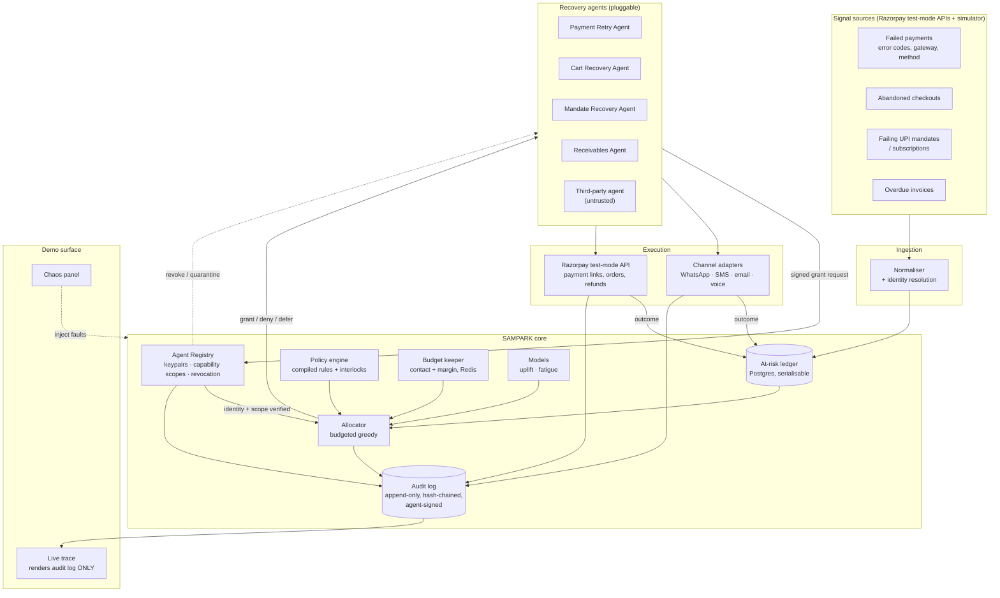
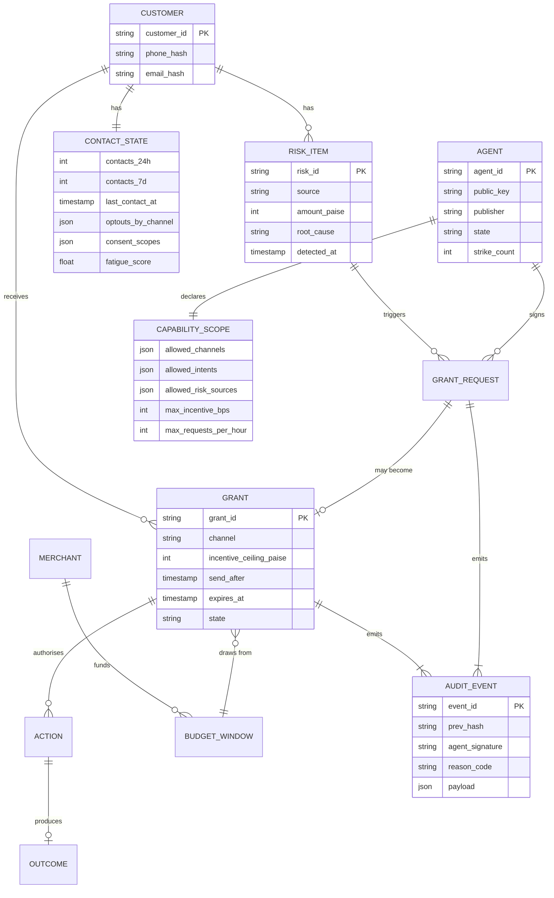

# SAMPARK
### A mediation layer for revenue-recovery agents
**Razorpay AI Buildathon 2026 — Track 03: AI Revenue Recovery**

> Razorpay built Optimizer to route every *incoming* transaction to the gateway most likely to succeed.
> Nobody built the equivalent for money coming *back*.
> Every recovery agent currently routes itself.

---

## 0. TL;DR

Razorpay now ships at least four independent systems that can autonomously contact the **same end customer** about the **same money**: the Cart Abandonment Recovery Agent, the Subscription Recovery Agent, the UPI AutoPay Intelligent Retry Engine, and the RazorpayX Receivables Agent. Each is individually well-guarded. None of them knows the others exist.

Agent Studio is opening to third-party builders. The failure mode is about to shift from *"one agent misbehaves"* (solved) to *"many agents, each individually correct, collectively harmful"* (unsolved).

**SAMPARK** (संपर्क — "contact") is the layer that makes that safe and, separately, makes it *more profitable*. It gives every agent a cryptographic identity with a declared capability scope, then treats customer attention and merchant margin as **scarce, budgeted inventory** — allocating each at-risk rupee to at most one agent, on one channel, at one time, with one bounded incentive. Every grant and every denial is signed by the requesting agent's key and written to an append-only log.

The central claim in one sentence: **authorization decides whether an agent *may* act; it cannot decide which of several equally-authorized agents *should*.**

The submission proves it two ways: a head-to-head batch over a synthetic merchant month, and a live trace UI in which every visible step is rendered from the audit log — so watching the demo work is itself evidence the log is correct.

---

## 1. Submission context (read this before anything else)

| Item | Fact |
|---|---|
| What it actually is | Hiring funnel for **AI Builder Intern**, not a prize hackathon |
| Offer | ₹75,000/month, 6 or 12 months, in-person Bangalore, start listed **September** |
| Deadline | Applications close **5 September 2026** |
| Deliverables | Public GitHub repo · 5-minute pitch video · architecture · short form |
| Screening | No resume screen, no aptitude test, no GD. Shortlist → panel |
| Judging axes | **Problem taste** · **Build quality** (does it run, is it structured, would you trust it) · **AI judgment** (right tool in the right place, *and where you chose not to use one*) · **Failure recovery** (what broke, and what you did about it) |
| Implication | Three of the four axes are about execution and honesty, not the idea. The repo *is* the interview. Commit history, `DECISIONS.md`, and tests carry as much signal as the architecture |

**Flag:** the September start conflicts with a 7th-semester timeline. Raise deferral in the application form, not after a panel.

**Note on "Failure recovery."** That axis is phrased in the past tense — *what broke*. It is asking about your build, not only your designed failsafes. `DECISIONS.md` (§18.0) is the artifact that answers it, and it cannot be retrofitted on day 14.

---

## 2. Track selection

**Chosen: Track 03 — AI Revenue Recovery.**

Track 03's stated bar is, almost word for word, a description of SAMPARK's output:

> *"Don't just identify the problem. Show measured money recovered across a batch, with compliant escalation, stopping rules, and an audit trail."*

Compliant escalation, stopping rules and an audit trail are not features you bolt onto a recovery agent. They are only *meaningfully* enforceable one level above the agents — which is exactly what SAMPARK is.

**Why not the others:**

| Track | Why not |
|---|---|
| 01 — Agentic Commerce | Strongest hype, worst signal-to-noise. Every second applicant will build a conversational checkout on UPI Reserve Pay. Razorpay already piloted this with NPCI on Claude and on ChatGPT. You'd be demoing their own demo |
| 02 — AI Risk Manager | Cleanest ML track and a genuine fit for an ML profile, but it needs a defensible labelled dataset. Synthetic fraud labels make precision/recall meaningless, and the track explicitly demands *honest* metrics on a held-out set. High risk of an unfalsifiable number |
| 04 — Finance Controller | Reconciliation is a solved demo. Razorpay's Agentic Dashboard already does "upload a bank statement, reconcile against settlements." Match-rate on synthetic data is easy to game and everyone knows it |
| 05 — Open Track | SAMPARK *is* infrastructure and would sit here honestly. But Open forfeits the "you asked for this" scaffolding and invites the question "why didn't you pick a track?" Track 03 gets the same idea graded against a bar it already satisfies |

**Rejected alternative worth recording:** a scoped-down **agent authorization gateway** — OAuth/SSO for agents plus fine-grained, context-aware tool permissions. Genuinely important infrastructure, and the right substrate for everything here. It is *not* the right submission, for three reasons developed in §3 and §14: Razorpay already ships a platform validation layer that does scope checks and out-of-scope behaviour detection; the same idea was built at Razorpay HQ in March 2026 (team RAIL, a tool-call interception proxy evaluating against DPDPA/EU AI Act) and did not place; and it fits no track while containing very little AI. Its best ideas are absorbed into SAMPARK as the Agent Registry (§8.1) rather than discarded.

**Honest caveat to state in the README:** SAMPARK is a control plane, not a single recovery agent. It contains four thin recovery agents so the batch metric is real. Say this in the first paragraph rather than letting a reviewer catch it.

---

## 3. Prior-art audit — the part most applicants will skip

Cross-referencing every "example direction" on the track page against what Razorpay has actually shipped (FTX'26 / Sprint'26, March 2026):

| Track page suggests | Razorpay already ships | Status |
|---|---|---|
| Checkout drop-off recovery | Cart Abandonment Recovery Agent (voice + WhatsApp, Nugget by Zomato / SuperU) | **Shipped** |
| Failed-subscription recovery | Subscription Recovery Agent (ElevenLabs voice, Hindi/English) | **Shipped** |
| Mandate retry sequencer | Intelligent Retry Engine for UPI AutoPay (WhatsApp nudges + incentives) | **Shipped** |
| B2B receivables chaser | RazorpayX Receivables Agent (tracks invoices, follows up on call) | **Shipped** |
| Chargeback evidence responder | Dispute Auto-Responder / Dispute Expert | **Shipped** |
| Return-risk scorer | RTO Shield (LLM address validation, pincode intelligence) | **Shipped** |
| Forward cash forecaster | Cashflow Forecaster (3–7 day cash position, payroll risk alerts) | **Shipped** |
| Multi-source reconciliation | Agentic Dashboard (upload statement → reconcile vs settlements) | **Shipped** |
| Payment degradation → recovery | Optimizer dynamic routing, 20-min gateway cooldowns, smart retry, multi-bank routing | **Shipped** |
| Conversational in-app checkout | Agentic Payments on Claude / ChatGPT, UPI Reserve Pay, Voice Payments | **Shipped (piloted)** |
| *(not on the track page)* Agent tool authorization | Platform validation layer: compliance boundaries, amount validation, PII handling, **scope checks**, out-of-scope behaviour detection; OAuth connector flows; per-agent certification | **Shipped** |

**Conclusion: the example directions are decoys.** They are a list of what Razorpay has already built. Building one of them is volunteering to be compared against a production team's version.

The last row is the one that kills the authorization-gateway alternative. What Razorpay describes as its validation layer *is* context-aware tool authorization — a per-action check against approved permissions, amounts, PII rules and compliance limits, with behaviour outside an agent's intended function blocked before execution.

### What is *not* shipped

Read Razorpay's own guardrails post carefully. Every single control is scoped to **one agent**:

- merchant approves *the agent's* data scope and actions
- *the agent* can run in review-first mode
- *the agent's* discount ceiling comes from the merchant's coupon config
- consent is validated *per communication*
- *the agent's* actions are logged to *the agent's* performance dashboard
- *each agent* is certified individually before entering the marketplace
- *each action* is validated individually against *that agent's* approved scope

That last line is the crux. A permission check evaluates one request at a time and answers a binary question. It is structurally incapable of seeing composition — and every failure below is a composition failure, assembled entirely from individually-permitted actions.

1. **Cross-agent contact budgeting.** Four agents, four valid consents, four approved scopes, one exhausted human being. Every call is authorized. The sequence is still harassment.
2. **Conflicting-action interlocks.** RTO Shield flags a COD order while Cart Recovery is still nudging that customer to complete it. A refund is issued while the Dispute Responder is mid-contest. A customer under fraud review receives a loyalty discount. Each action is in scope for the agent that took it.
3. **Aggregate margin authority.** Cart recovery caps at 10%. Subscription save-offer caps at 15%. Retry Engine adds an incentive nudge. Each ceiling is respected; the *total* given away per customer is unbounded.
4. **Counterfactual attribution.** Agents are priced usage-based, subscription-based *or outcome-based*. Two agents touch one recovering payment; both can claim it. Outcome-based pricing without a shared attribution ledger is a billing dispute waiting to happen.
5. **Pre-production replay.** "Underperforming agents are identified and improved" — post hoc, on live money and live customers. No shadow environment for a third-party agent before it touches a real person.

Items 1–5 stop being theoretical the moment the marketplace opens to third-party builders — which Razorpay has publicly committed to.

---

## 4. Problem statement

### The broad problem
Razorpay solved *agent safety* and skipped *agent society*. Every guardrail — including the authorization layer — is a property of one agent evaluated in isolation. Merchant harm is a property of the **set**.

### Why authorization cannot fix this
Permission systems answer *may this agent do this thing?* one request at a time. Their power comes from being stateless with respect to other agents — that is what makes them fast, auditable and composable.

It is also what makes them blind here. Every one of the four agents contacting the same customer has valid consent, an approved scope, an in-policy discount and a registered template. **A perfect authorization layer permits all four, because each is individually legitimate.** The harm is emergent, and emergence is invisible to a per-request predicate.

Authorization is necessary and insufficient. What is missing is a **comparative** decision over a **shared, depletable** resource — not permit/deny but *rank, allocate, defer, downgrade*, with memory of what every other agent already spent.

### The niche, buildable problem
> **Revenue-recovery agents each maximise their own recall. The merchant's actual objective is net margin per customer relationship, under a finite and regulated contact budget. Independent maximisation of a shared, depletable resource is greedy local optimisation — it is provably suboptimal, and in India it is also a regulatory exposure.**

Concretely, for a single customer named Priya who has an abandoned cart, a failing UPI mandate, and an overdue invoice, all in the same 48 hours:

- **Today:** three agents, three consents, three approved scopes, three contacts. Possibly a voice call at 9:40 PM. Possibly two stacked discounts. Possibly a fourth nudge after she opted out of a *different* agent's channel. If she converts, two agents bill the merchant for the outcome. **Nothing was unauthorized.**
- **With SAMPARK:** one contact. The one with the highest expected net recovery. On the channel she actually responds to. Inside quiet hours. Drawing from a single margin budget. With the other two requests logged as explicit, explainable denials, signed against the requesting agents' identities.

The uncomfortable part: **the mediated version usually recovers more money**, because contact fatigue is real and every wasted contact raises the hazard of a permanent opt-out — which destroys all future recovery on that customer.

### Regulatory anchors (India, non-optional)
- **TCCCPR 2018 + Second Amendment 2025** — DLT template registration, 7-day validity on transactional consent, abolition of consent inferred from a business relationship, 9 PM–9 AM blackout, opt-out honouring.
- **DPDP Act 2023** — purpose limitation. Consent for subscription-recovery contact is *not* consent for cart-recovery contact.
- **Guidelines for Prevention and Regulation of Dark Patterns, 2023** — Razorpay's own certification screens for false urgency *per agent*. Escalating pressure assembled from three separate compliant agents is still escalating pressure.

---

## 5. The idea

**SAMPARK is a mediation and clearing layer that sits between recovery agents and the customer.**

No agent contacts a customer directly. Every agent presents a scoped identity and requests a **Contact Grant**. SAMPARK issues, denies, defers or downgrades that request, and settles the outcome afterwards.

Six things it owns that no individual agent can:

1. **Agent identity and capability scope** — every agent registers once and receives a keypair and a declared capability set (channels, intents, maximum incentive, eligible risk sources). Requests are signed. This is the authorization substrate, and it is deliberately the *floor* of the system rather than its ceiling.
2. **The unified at-risk ledger** — every rupee at risk from every source, resolved to a single customer identity. Failed payments, abandoned carts, failing mandates, overdue invoices, lapsing subscriptions.
3. **The contact budget** — a finite attention allowance per customer per rolling window, with quiet hours, channel caps, opt-out state and consent scope as hard constraints, not soft preferences.
4. **The margin budget** — one authority pool per customer and per merchant per day. Agents draw down from it; they do not each get a private ceiling.
5. **The allocator** — the decision. Which agent, which channel, when, how much incentive. Maximises expected net recovery under all budgets simultaneously.
6. **The attribution ledger** — who actually caused the recovery, with a holdout arm so the answer isn't just last-touch.

Item 1 is the layer an authorization product would ship on its own. Items 2–6 are what it cannot express. Keeping both in one system, and being explicit about which is which, is the intellectual content of this submission.

### The one-line pitch
> *"Optimizer decides which gateway gets the payment. SAMPARK decides which agent gets the customer."*

That framing lands instantly with anyone at Razorpay, because it is a pattern they already believe in and already own.

---

## 6. Architecture

### 6.1 System context



Note the single arrow into the demo surface. **Nothing else feeds the UI.** That constraint is architectural, not cosmetic — see §12.1.

### 6.2 Contact grant lifecycle (two-phase, with compensation)

```mermaid
sequenceDiagram
    autonumber
    participant AG as Recovery agent
    participant RG as Agent Registry
    participant SM as SAMPARK allocator
    participant PB as Policy + budgets
    participant CH as Channel adapter
    participant LG as Ledger + audit

    AG->>RG: signed request_grant(customer, risk_item, intent, channel, max_incentive)
    RG->>RG: verify signature · check capability scope · check not revoked
    alt outside declared capability
        RG-->>AG: DENY {scope_violation, capability_required}
        RG->>LG: record violation, increment strike count
    else in scope
        RG->>SM: forward verified request
        SM->>PB: evaluate hard constraints
        PB-->>SM: quiet hours OK · consent scope OK · no interlock · budget available
        SM->>SM: score all competing requests for this customer
        Note over SM: expected_net = p_recover x amount<br/>- channel_cost - incentive<br/>- fatigue_cost
        SM->>LG: RESERVE contact slot + margin (idempotency key)
        SM-->>AG: GRANT {channel, send_after, incentive_ceiling, grant_id, ttl}
        AG->>CH: execute(grant_id, payload)

        alt success
            CH-->>AG: delivered
            AG->>LG: CONFIRM(grant_id, outcome)
        else provider failure / timeout
            CH-->>AG: error
            AG->>LG: ROLLBACK(grant_id)
            LG->>PB: release margin, restore contact slot
            Note over LG,PB: slot is NOT silently consumed;<br/>no double-send on retry
        end
    end

    SM-->>AG: DENY {reason_code, human_readable, next_eligible_at}
```

Note the two distinct denial paths. A **scope violation** is answered by the Registry without the allocator ever running — that is authorization, and it is cheap and binary. A **budget or interlock denial** requires the full comparative evaluation — that is allocation, and it is the expensive, stateful, cross-agent part. Keeping them visibly separate in the sequence, and visibly separate in the live trace, is the architecture making the argument for you.

### 6.3 Data model (core entities)



---

## 7. Tech stack

| Layer | Choice | Why this and not something else |
|---|---|---|
| Mediation API | **Python 3.11 + FastAPI** | Grant issuance is a synchronous, low-latency decision. Async framework, typed contracts via Pydantic |
| Agent identity | **Ed25519 keypairs**, detached signatures on every request; capability scopes as signed JSON claims; Postgres-backed registry with revocation list | Small, dependency-light, non-repudiable. Deliberately *not* a full OIDC/OAuth deployment — see §15.9. Enough to make quarantine real and audit events attributable |
| Ledger | **PostgreSQL 16**, `SERIALIZABLE` on grant issuance | Two agents requesting the last contact slot concurrently is the central correctness problem. This must be a real transaction, not application logic. Say so in the README — it is the single most senior-looking decision in the project |
| Budget counters | **Redis** (rolling windows, distributed locks, TTL on reservations) | Cheap, expiring, and lets a crashed agent's reservation auto-release |
| Agents | Separate processes, **Razorpay Python SDK** + **Razorpay MCP Server** (`rzp_test_` keys) | Real payment links, orders and refunds appear in a real test dashboard. Using their official MCP server is a deliberate fluency signal |
| LLM | **Claude via Anthropic API** | Two jobs only (§9). Razorpay built Agent Studio on the Claude Agent SDK, so stack alignment is free credibility |
| Models | **LightGBM / scikit-learn** — uplift (T-learner), fatigue hazard, calibration (isotonic) | Small data, tabular, must be explainable to a risk reviewer. Deep learning here would be a red flag, not a green one |
| Allocator | **Budgeted greedy by expected-net density**, with a measured optimality gap | *Changed from CP-SAT.* At demo scale greedy is within a small, measurable distance of optimal, and you can explain it in one sentence under panel pressure. A constraint solver you wired up on day 10 and can't defend is worse than a heuristic you can. Report the gap; don't hide the choice |
| Channels | Adapter interface; **mocked** WhatsApp/SMS/voice providers, one real email path | You cannot lawfully cold-call real numbers with synthetic consent. Mock, log the exact payload, and be loud about why |
| Simulator | NumPy/Pandas, seeded, deterministic | Reproducibility is the credibility |
| Demo surface | **FastAPI + server-sent events → a single-page UI**, rendering the audit log only | See §12. Not a product frontend. Interactive, legible, and structurally incapable of lying |
| Ops | Docker Compose · pytest · GitHub Actions · OpenTelemetry traces · structlog JSON | `docker compose up` → seeded demo in under two minutes |

---

## 8. How it works

### 8.1 Agent registration and capability scoping
An agent registers once. It receives an `agent_id` and a keypair, and declares a capability scope: which channels it may request, which intents it may express, which risk sources it may act on, its maximum incentive in basis points, and its request rate ceiling. Every subsequent grant request carries a detached Ed25519 signature over the request body.

Three things this buys, all of which matter later:

- **Requests outside the declared scope are rejected without consuming allocator time** — cheap, binary, exactly what an authorization layer should do.
- **Quarantine becomes real.** An agent that accumulates strikes has its key revoked in the registry. It is not disabled by a config flag someone has to remember to flip; it simply cannot produce a verifiable request.
- **Audit events are attributable.** Every decision is signed by the agent that requested it, so attribution and billing disputes have a non-repudiable record.

This is the floor of the system. §8.5 onward is everything the floor cannot do.

### 8.2 Ingestion and identity resolution
Signals arrive from Razorpay webhooks (test mode) and the simulator. The normaliser maps each to a `RISK_ITEM` with a canonical amount, source, and detected time, then resolves the owner to one `CUSTOMER` via hashed phone/email. **Deduplication happens here, before any agent sees anything** — one human is one row, no matter how many products noticed them.

### 8.3 Root-cause classification — deterministic, and that is the point
Raw failure context maps onto a fixed taxonomy: `insufficient_funds`, `issuer_downtime`, `mandate_expired`, `authentication_drop`, `price_hesitation`, `intent_lost`, `disputed`, `unknown`.

**This was originally an LLM call. It was cut.** Gateway error code → failure class is a lookup table. A model here would be slower, non-deterministic, occasionally wrong, and impossible to justify under questioning. The mapping lives in a versioned YAML file with a test per entry, and anything unmapped falls to `unknown` and is counted in a metric.

Removing this is a deliberate answer to the *AI judgment* axis, which explicitly asks where you chose **not** to use a model. Say it out loud in the video and the README.

### 8.4 Policy compilation
The merchant writes policy in plain English:

> *"Never contact anyone more than twice in 24 hours. No voice calls before 10 AM. Never offer a discount to a customer who has raised a chargeback in the last 90 days. Stop all recovery on an order that RTO Shield has flagged."*

An LLM compiles this into executable rule objects **plus a generated pytest case for each rule**. The tests are committed. The rules only activate if their tests pass. This is the honest version of "no-code agent building" — the natural language produces a *checked artefact*, not an unverifiable prompt. This is now the strongest of the two remaining LLM uses, so make sure it is genuinely working before anything cosmetic gets built.

### 8.5 Hard constraints (never traded off)
Regulatory and safety rules are filters, not terms in the objective. Quiet hours, opt-out state, consent scope, DLT template availability, interlocks, and per-window caps eliminate candidates **before** scoring. No expected-value calculation can ever buy its way past them. This separation is the entire compliance argument and must be visible in the code structure — `policy/hard/` and `policy/soft/` as separate packages.

Note that capability scope (§8.1) and hard constraints are *both* filters, but they filter different things: scope asks whether this agent is the kind of thing that may make this request at all; hard constraints ask whether this request is admissible right now given the customer's state. Both are permit/deny. Neither is a decision.

### 8.6 Scoring
For each surviving candidate `(agent, risk_item, channel, time_slot, incentive)`:

```
expected_net = p_recover(customer, risk_item, intervention)  ×  amount_at_risk
             − channel_cost
             − expected_incentive_spend
             − fatigue_cost
```

where

```
fatigue_cost = Δ P(opt_out | contact_history + this_contact)  ×  customer_forward_value
```

That fatigue term is the whole thesis expressed as arithmetic. It is why an unmediated system over-contacts: **no individual agent internalises the cost of burning a customer that another agent will need next week.** No permission model can express it either, because it is a property of the shared future, not of the current request. SAMPARK can, because it is the only component that sees both.

### 8.7 Allocation
Per customer, per time window, assign greedily by expected-net density subject to: contact caps, margin budget, channel capacity, one grant per customer per window, and a fairness floor so a low-value risk item is not starved forever (it escalates by ageing, exactly as a real collections process does).

**On the optimality gap:** the greedy solution is not guaranteed optimal. Measure it — run an exact solver offline over a sample of windows, report the mean and worst-case gap in `results/`, and state the number. A heuristic with a published gap is more trustworthy than a solver with an unexamined one. Exact online solving is named as future work, not shipped.

### 8.8 Interlocks
A conflict matrix, checked at grant time, encoding mutually exclusive states:

| If this is true | Then block |
|---|---|
| RTO Shield flagged the order | cart recovery, upsell |
| Refund issued or in flight | dispute contest, retry |
| Customer in fraud review | all promotional contact, all incentives |
| Chargeback raised in last 90 days | any discount-bearing grant |
| Mandate cancellation requested | mandate retry |
| Grant already active this window | every other agent |

Every row is a pair of actions that are *individually in scope for their respective agents*. That is precisely why the matrix has to live above them.

### 8.9 Attribution and settlement
A configurable holdout fraction of risk items is deliberately left uncontacted. Recovery in the holdout is the natural-recovery baseline. Credited recovery = observed recovery − expected natural recovery, assigned to the granted agent, signed against that agent's identity. This is what makes outcome-based agent pricing honest, and it is a direct answer to a commercial problem Razorpay has already created for itself by offering outcome-based pricing in a multi-agent marketplace.

### 8.10 Audit and explanation
Every registration, revocation, request, grant, denial, reservation, rollback and outcome is an append-only, hash-chained event carrying the requesting agent's signature and a machine reason code. An LLM renders any decision in plain English on demand:

> *"Priya was not called about her abandoned cart at 21:40 on 12 Sept. The Cart Recovery Agent's request was in scope and correctly signed. It was denied for two reasons: the request fell inside quiet hours (TCCCPR blackout), and her daily contact budget was already spent by the Mandate Recovery Agent at 14:05, which had 3.2× higher expected net recovery (₹4,100 at risk vs ₹680). The cart request was deferred to 10:00 on 13 Sept."*

The explanation is generated **from the log**, never from the model's memory. It can be wrong about phrasing; it cannot be wrong about facts.

---

## 9. Where the LLM genuinely earns its place

**Two jobs.** It was three; one was cut and the cut is part of the argument.

1. **Policy compilation** — English → executable rules **+ generated tests**. Verified artefact, not vibes. This is the one that has to work.
2. **Audit explanation** — decision log → human sentence, read-only, cannot influence outcomes.

**Removed:** root-cause classification (§8.3). A dictionary is correct; a model is probabilistic. Shipping the dictionary and deleting the model call is the single cleanest signal available on the *AI judgment* axis.

Deliberately **never** LLM-driven: signature verification, scope checks, the allocation decision, the budget arithmetic, the compliance filters, the attribution maths. A model that can hallucinate must never sit on the path to a money action. Put that sentence in the README.

---

## 10. Data flow — one rupee, end to end

```mermaid
flowchart LR
    S1["09:12 mandate debit fails<br/>Rs 4,100"] --> S2["Normalise +<br/>resolve to Priya"]
    S2 --> S3["Root cause lookup:<br/>insufficient_funds"]
    S3 --> S4["Ledger: risk_item created<br/>Priya now has 3 open items"]
    S4 --> S5["3 agents submit<br/>signed requests"]
    S5 --> S6{"Registry:<br/>signature + scope"}
    S6 -->|"all 3 verified,<br/>all in scope"| S7{"Hard filters"}
    S7 -->|"cart: quiet hours OK<br/>invoice: consent scope fail"| S8["2 survive"]
    S8 --> S9["Score both"]
    S9 --> S10["Mandate: Rs 1,240 expected net<br/>Cart: Rs 190 expected net"]
    S10 --> S11["Allocate to<br/>Mandate Agent"]
    S11 --> S12["RESERVE slot + Rs 0 margin"]
    S12 --> S13["WhatsApp, 14:05,<br/>DLT template MR_02"]
    S13 --> S14["Razorpay test API:<br/>payment link created"]
    S14 --> S15["Paid 14:31"]
    S15 --> S16["CONFIRM: Rs 4,100 recovered<br/>credited vs holdout baseline"]
    S16 --> S17["Cart item: deferred,<br/>next eligible 13 Sept 10:00"]
```



The shape of this trace is the argument. Authorization clears all three requests at step S6 — nothing is unauthorized, nothing is malicious. Two of the three are stopped afterwards, by state that no per-request permission check has access to.

**This exact diagram is what the live UI renders**, node by node, from audit events, in real time. The static version above and the running version are the same thing.

---

## 11. Evaluation protocol

This is what the video opens with, and it is the reason to pick Track 03.

**Setup:** one synthetic merchant month. ~5,000 customers, ~20,000 risk items across four sources. Generator is seeded, committed, and documented — including the hidden response process (conversion propensity, fatigue hazard, price sensitivity) that the models are *not* given.

**Arms:**
- **A — Status quo.** Four agents, each with its own guardrails and a correct capability scope, each maximising its own recall. This is a faithful model of today's Agent Studio: fully authorized, fully unmediated.
- **B — SAMPARK.** Identical agents, identical scopes, identical budgets, mediated.
- **H — Holdout.** No contact. Natural recovery baseline.

**Cold start honesty:** models for Arm B are trained on logs from Arm A, not on the generator's ground truth. That is how it would actually work in production, and it makes the result defensible instead of circular.

**Report all of these, including any that go against you:**

| Metric | Arm A | Arm B | Δ |
|---|---|---|---|
| Net revenue recovered (₹) | | | |
| Total contacts sent | | | |
| ₹ recovered per contact | | | |
| Margin given away (₹) | | | |
| Scope violations caught by Registry | | | |
| Quiet-hour violations | | | |
| Post-opt-out contacts | | | |
| Consent-scope violations | | | |
| Contact-cap breaches | | | |
| Conflicting-action incidents | | | |
| Customers contacted 3+ times/24h | | | |
| Cumulative opt-out rate | | | |
| Double-attributed recoveries | | | |
| Allocator optimality gap (mean / worst) | — | | |
| p99 grant decision latency | | | |

The scope-violation row is deliberately expected to read **0 / 0** for the four well-behaved agents in both arms. Say that out loud in the video. It is the cleanest possible demonstration that authorization was never the binding constraint — every other row moves, and that one doesn't.

Add a **sensitivity analysis**: sweep the fatigue-hazard parameter across a plausible range and plot where SAMPARK stops winning. Publishing the conditions under which your own system loses is the single highest-trust move available to you, and almost nobody does it.

---

## 12. Graceful failure and the live demo surface

### 12.1 The trace-integrity rule (non-negotiable)

**The UI renders the audit log and nothing else.** No `emit_demo_event()`, no parallel websocket telemetry, no component reporting its own progress to the frontend.

The reason is not aesthetic. An instrumented visualization is a *second code path*, which means the demo can be correct while the system is broken — and animated pipelines are the most common way hackathon demos mislead, usually by accident. A judge assessing *"would you trust it"* is specifically looking for this.

Inverting it turns the demo into evidence: if a stage doesn't write a durable, hash-chained audit event, it doesn't appear on screen. **The animation moving is proof the log is being written correctly.**

Make the coupling visible. Split view: the flow trace on one side, the raw JSON audit event with its `event_id` and `prev_hash` on the other, updating in lockstep. Anyone can see the picture is downstream of the record.

Two related honesty rules:

- **Label time compression.** A month of 20k events is unwatchable. Run a seeded replay of the interesting slice in ~40 seconds with a visible `1 sim-hour ≈ 0.4s` badge. If you insert a delay so a step is legible, label that too. Unlabelled time manipulation, if noticed, costs more than the demo gained.
- **Deterministic.** Same seed, same trace, every run. You will re-record six times and demo live to a panel; a non-deterministic run will eventually hand you a result you have to talk your way past.

### 12.2 UI: not the focus, but do not treat it as disposable

The frontend is roughly 5% of the engineering and a disproportionate share of whether anyone *understands* the other 95%. A control plane is invisible by nature — the UI is the only thing that makes the argument legible in five minutes. Under-investing here means the best part of the project never lands.

The bar is **legible and interactive**, not beautiful. Concretely:

- **One screen.** Left: the live flow trace (§6.1 rendered as nodes that light up). Right: raw audit events streaming. Bottom: the running metrics for Arm A vs Arm B side by side.
- **Interactive, not a video loop.** Click any node → the events behind it. Click any customer → their full contact history and every denial with its reason. Click any denial → the plain-English explanation from §8.10, generated live.
- **Colour carries one meaning only.** Granted / denied-on-scope / denied-on-budget / rolled-back. Four states, four colours, a legend on screen. Do not decorate beyond this.
- **Denials are visually louder than grants.** Every other demo shows happy paths. The denial is your thesis. Give it the strongest treatment on the page.
- **Monospace for anything that is a real record** — event IDs, hashes, reason codes, amounts. It signals "this is data, not marketing copy," which is exactly the impression you want.
- **Zero framework debt.** Server-sent events into vanilla JS or a single small library. Time-boxed to Phase 8. The moment you find yourself choosing an animation library, stop — that budget belongs to the evidence run.

Good design here means *the judge follows it without narration*. Test that: show it to someone who hasn't heard the pitch and see whether they can tell you what just got denied and why. If they can't, the UI has failed regardless of how it looks.

### 12.3 The three failures — triggered live, never pre-recorded

1. **Provider timeout mid-send.** Grant is reserved, voice provider hangs, TTL expires, reservation rolls back, margin returns to the pool, contact slot is restored, retry is idempotent under the same `grant_id`. No double-send, no silently burned budget.
2. **Rogue third-party agent, in two stages.** First it misbehaves *outside* its scope — attempts a voice channel it never declared, and a 40% discount above its `max_incentive_bps`. The Registry rejects both on signature-verified scope, no allocator involvement. Then it misbehaves *inside* its scope — six perfectly legitimate, correctly-scoped grant requests in one minute, plus a 23:15 request. Scope passes; budgets, rate ceiling and quiet hours deny. Strikes accumulate, the key is revoked, and the agent can no longer produce a verifiable request. **Show both stages.** The contrast between them is the entire thesis in ninety seconds of screen time.
3. **Model unavailable.** Kill the uplift service **on camera** — `docker kill sampark-uplift` in a visible terminal. The allocator degrades to unweighted heuristic ranking, logs a degradation event, and keeps issuing grants. Recovery drops; compliance does not. That distinction is the whole design philosophy.

The gap between a *demonstrated* failsafe and a *described* one is most of the Failure-recovery axis. Never cut to "and here's what happens when it fails."

### 12.4 The chaos panel — build this for the panel, not the video

A small control strip that lets **someone else** break the system:

| Control | What it exercises |
|---|---|
| Kill uplift model | Graceful degradation |
| Revoke agent key | Registry quarantine |
| Set clock to 21:40 | TCCCPR quiet-hour filter |
| Force provider timeout | Reservation rollback |
| Flood rogue agent to 6 req/min | Rate ceiling + strikes |
| Mark customer opted-out mid-run | Permanent suppression |
| Trigger RTO flag on an active cart | Interlock matrix |

Then hand over the laptop and say *"try to break it."*

Almost no candidate makes that offer, because almost no candidate's project survives it. Yours is designed to — every one of those behaviours is already required by §12.3. The chaos panel is seven buttons over capability you are building anyway, and it converts the panel interview from a presentation into a demonstration.

### 12.5 What did NOT get handled

List the failure modes you know about and deliberately did not cover — network partition between allocator and Redis, clock skew across agents, a Postgres failover mid-reservation. Naming them is worth more than silently having no answer, and it pre-empts the question rather than losing to it.

---

## 13. Scope decisions

### In
- Agent Registry: Ed25519 identities, declared capability scopes, signed requests, strikes, revocation
- Unified at-risk ledger with identity resolution
- Contact budget + margin budget, transactional reservation
- Hard-constraint policy engine + interlock matrix
- Budgeted greedy allocator with measured optimality gap
- Uplift + fatigue models, calibrated, with ablation
- Attribution ledger with holdout arm
- Hash-chained, agent-signed audit log + LLM explanation endpoint
- Four thin recovery agents + one deliberately rogue agent
- A/B/H simulation harness with committed generator
- Live trace UI + chaos panel, rendering the audit log only
- `DECISIONS.md` build log, written daily
- Docker Compose, pytest, CI

### Out — and say why in the README
| Cut | Reason |
|---|---|
| **CP-SAT / exact online solving** | Greedy is within a measured gap at demo scale and defensible in one sentence. A solver you can't explain under questioning is a liability, not a feature. Gap is published; exact solving is future work |
| **LLM root-cause classification** | A lookup table is correct and a model is probabilistic. Cutting it is a positive signal on the AI-judgment axis, not a gap |
| Full OAuth 2.1 / OIDC agent federation | The registry proves the *shape* of scoped identity in ~200 lines. A real deployment federates against the merchant's IdP; that is productisation, not thesis |
| Real voice calls | Cannot lawfully cold-call real numbers on synthetic consent. Mocked, payload logged |
| Real WhatsApp BSP | Needs a WABA and approved DLT templates. Mocked with template IDs |
| A fifth, "better" recovery agent | Explicitly not the point. The agents are deliberately boring |
| Multi-tenant SaaS, auth, billing UI | Not what is being evaluated |
| Any fine-tuning | Nothing here needs it. Claiming it would invite a question you'd lose |
| Blockchain audit log | Hash chain in Postgres is sufficient and honest |
| A component-library frontend | One screen, SSE, vanilla. See §12.2 |

---

## 14. Sprint-room decision log

Eight reviews, condensed to the arguments that actually changed the design.

**Round 1 — Project Lead vs. Product.**
*Product:* "A control plane doesn't demo. A reviewer watching 200 videos sees an architecture diagram and moves on."
*Lead:* "Then don't open with architecture. Open with two numbers side by side: rupees recovered, and contacts sent. If B recovers more with fewer contacts, the architecture explains itself."
→ **Decision:** the video opens on the metrics table. Architecture appears at 2:30, not 0:15.

**Round 2 — Backend Lead vs. ML Lead.**
*Backend:* "The uplift model is two weeks of work you don't have. A calibrated heuristic gets 80% of the lift."
*ML:* "Without a fatigue model, the annoyance penalty is a made-up constant and the whole thesis is hand-waving."
→ **Decision:** both, sequenced. The allocator is model-agnostic behind an interface. Heuristic first (Phase 4), models as an upgrade (Phase 6), heuristic reported as an ablation row. If the models slip, the project still stands. Separately, CP-SAT is cut entirely — greedy with a published optimality gap is the shipped allocator.

**Round 3 — Risk & Compliance.**
*Compliance:* "You cannot claim 'compliant'. You're a student, with synthetic data, quoting regulations you haven't been audited against. One sentence like that and a Razorpay reviewer stops reading."
*Lead:* "Agreed. We claim *policy-enforced* and we ship the policies as code with citations and tests."
→ **Decision:** every regulatory rule lives in `policies/` with a source link and a passing test. The word "compliant" never appears unqualified. Add a `DISCLAIMER.md`.

**Round 4 — DevOps/SRE.**
*SRE:* "Two agents requesting the last contact slot at the same millisecond. What happens?"
*Backend:* "Application-level check, then insert."
*SRE:* "So both succeed. That's the bug your entire product exists to prevent, and it's in your own code."
→ **Decision:** grant issuance moves into a `SERIALIZABLE` transaction with an explicit unique constraint on `(customer_id, window_id)`. A concurrency test — 50 simultaneous requests, assert exactly one grant — is committed and called out in the README.

**Round 5 — Security / IAM.**
*Security:* "Everything downstream assumes the agent is who it says it is. Right now an agent is a string in a JSON body. Your rogue-agent demo is a config flag, and your attribution ledger — the thing you want to bill on — is unsigned and repudiable."
*Lead:* "Fair, but I'm not building an OAuth server; that's a different product and it eats a week."
*Security:* "You don't need one. Keypair per agent, declared capability scope, detached signature per request, revocation list. Two hundred lines. It makes quarantine real and audit non-repudiable, and it costs you a day."
→ **Decision:** the Agent Registry goes in as §8.1 — the floor of the system, not the point of it.

**Round 6 — the authorization objection (and why it isn't the project).**
*Security, pushing further:* "If identity and scoping are this useful, why isn't fine-grained context-aware tool authorization the whole submission?"
*Lead:* "Three reasons. Razorpay already ships it — their validation layer does scope checks, amount validation, PII handling and out-of-scope behaviour detection on every agent action. A team called RAIL built exactly this at Razorpay HQ in March and it didn't place. And the real one: **every harmful action in our failure catalogue is authorized.** A perfect authorization layer permits all four calls to Priya, because permission systems evaluate one request at a time and their value comes from being blind to what other agents are doing. Necessary and insufficient. We take it as substrate and build the layer it cannot express."
→ **Decision:** authorization becomes §8.1, not the thesis. The distinction is stated in §4, shown in the two denial paths of §6.2, dramatised in the two-stage rogue demo (§12.3), and *controlled for* by the scope-violation metric row that is expected to read zero.

**Round 7 — Data/Simulation.**
*Data:* "If you tune the generator, you can make SAMPARK win by any margin you like. Every reviewer knows that."
→ **Decision:** commit the generator, publish the parameters, add the sensitivity sweep showing where SAMPARK *stops* winning.

**Round 8 — Demo integrity.**
*Product:* "Instrument each component to push progress events to the frontend. The animation will be much smoother."
*SRE:* "Then the demo is a second code path and it can be green while the system is red. That's the exact failure mode a judge is scanning for on 'would you trust it'."
*Lead:* "Invert it. The UI subscribes to the audit log and nothing else. If a stage doesn't write a durable event, it doesn't render. Smoothness is not the goal — the animation moving *is* the proof the log is correct."
*Product:* "That's a worse-looking demo."
*Lead:* "It's a demo that means something. And we spend the design budget on legibility instead — split view with raw events, four-colour state legend, denials visually loudest. Not pretty, but understandable without narration, which is what actually matters in five minutes."
→ **Decision:** §12.1 and §12.2. Two stages had to be rewritten to emit durable events they were previously skipping. **That rewrite goes in `DECISIONS.md`** — it is a genuine build incident and it answers the Failure-recovery axis in your own voice.

---

## 15. Limitations

State these in the README. Volunteering them is worth more than the metrics.

1. **Synthetic data.** No real merchant recovery logs are publicly available. Every number is conditional on the generator, which is committed and parameter-swept — but it is not evidence about the real world.
2. **Simulated response behaviour.** Conversion, fatigue and opt-out come from a hand-specified process. Real Indian consumer response to Hinglish voice recovery is not something this can measure.
3. **Regulatory encoding is an interpretation.** TCCCPR and DPDP rules are compiled by a student reading public text, not by counsel. Rules are cited and testable; they are not legal advice.
4. **Mocked channels.** No real WhatsApp, SMS or voice delivery. Deliverability, template rejection and carrier behaviour are unmodelled.
5. **Attribution is only as good as the holdout.** Small holdouts give noisy credit. At demo scale the confidence intervals are wide; they are reported.
6. **No real adversary.** The rogue agent misbehaves in scripted ways. A genuinely adversarial agent probing for reason-code side channels or gaming the scorer is out of scope. Specifically: **the allocator currently trusts agent-declared risk amounts.** A self-interested agent could win every grant by overstating. Mitigation is to source amounts from the ledger rather than the request; flagged, not implemented.
7. **Cold start.** Arm B's models learn from Arm A's logs, which are themselves biased by Arm A's policy. Off-policy correction is acknowledged, not implemented.
8. **Single-merchant scope.** Cross-merchant contact fatigue — the same human recovered by four different Razorpay merchants — is the obvious next problem and is deliberately out of scope.
9. **The identity layer is a demonstration, not a deployment.** Ed25519 keypairs and a local revocation list prove the shape of scoped agent identity. Production needs IdP federation, key rotation, short-lived credentials, delegated consent chains. This is the one area where a dedicated authorization product does strictly more than SAMPARK, and the README should say so plainly.
10. **The allocator is not optimal.** Greedy, with a measured gap against an offline exact solve. The number is published; the choice was deliberate; exact online solving is future work.

---

## 16. What this brings to the table

- **A named distinction.** *Authorization decides whether an agent may act; allocation decides which of several equally-authorized agents should.* Razorpay has shipped the first and not the second.
- **A named problem.** "Per-agent certification is structurally insufficient for a multi-agent marketplace" follows directly from something they have published.
- **A reusable primitive.** The Contact Grant — identify, scope-check, evaluate, reserve, execute, confirm or roll back. It slots under Agent Studio without changing any existing agent's internals.
- **An answer to a live commercial problem.** Outcome-based agent pricing needs shared, non-repudiable attribution. Signed grants plus a holdout ledger are that.
- **A correctness argument, not a demo.** Serialisable grant issuance, idempotent execution, compensating rollback, signature-verified requests, a committed concurrency test — and a UI that structurally cannot report success the system didn't achieve.
- **Falsifiability.** A/B/H arms, a committed generator, a sensitivity sweep, a published optimality gap, a published losing boundary, and a control metric expected to show no effect.
- **Restraint, twice.** Cut a constraint solver for a heuristic that can be defended. Cut an LLM call for a lookup table that is correct. Knowing where *not* to build is the scarcer skill in 2026, and one of the four judging axes asks for it by name.

---

## 17. How it helps Razorpay

**Immediate.** A merchant running four Razorpay recovery surfaces today has four unbudgeted contact streams pointed at their customers, all of them authorized. SAMPARK caps that without touching any agent's internals — pure infrastructure, no product migration.

**Commercial.** Outcome-based pricing across a multi-agent marketplace is not settleable without shared attribution, and attribution is not defensible without signed requests. Ship both before the first billing dispute, not after.

**Strategic.** Razorpay has committed to opening Agent Studio to third-party publishers. Certification and scope checks handle the agent you can inspect. They do not handle the *interaction* between agents written by different companies with different incentives, all pointed at the same customer. A mediation layer is what makes an open agent marketplace safe to run on a merchant's live customer base — and it is a moat, not a feature. Anyone can list agents. Anyone can build an authorization proxy. Only the party that owns the payment rails can arbitrate between agents, because only they see every rupee at risk across every product line.

**Reputational.** India's regulatory posture on unsolicited commercial communication is tightening, not loosening. The first public incident of "AI agents harassed a customer" will be attributed to the platform, not to whichever third-party agent sent the fourth message — and "every message was authorized" is not a defence anyone will accept.

**Product-line.** The same primitive generalises: allocating margin across upsell agents (Track 01), throttling verification requests across risk agents (Track 02), prioritising exception queues across finance agents (Track 04). The at-risk ledger becomes a merchant-wide obligation ledger; the Agent Registry becomes the substrate under all of it.

---

## 18. Phased development plan

Deadline 5 September. ~6 productive hours/day alongside 7th semester. Ten phases across fifteen days.

### 18.0 Working with agentic coding tools

You are building with Claude Code and Antigravity. That changes *how* to phase this, and it changes what the judges will see in the repo.

**Rules that matter here:**

- **You write the contracts; the agent writes the implementations.** Hand-author the Postgres schema, the Pydantic request/response models, the policy rule interface, and the audit event shape. These are the artifacts a panel will interrogate. An agent filling in a repository method behind a contract you designed is fine; an agent inventing your data model is how you end up unable to answer "why is this column here?"
- **Tests before implementation, every phase.** Agentic tools are dramatically more reliable with a failing test as the target. It also means the commit history shows test-then-code, which reads well.
- **One phase per session.** Start a fresh context at each phase boundary with the contracts and the phase's exit criterion. Letting one context sprawl across ten days produces confident, subtly inconsistent code — and you won't be able to explain it under questioning.
- **Three things you write by hand, no exceptions.** (1) The `SERIALIZABLE` grant-issuance transaction and its concurrency test — it is the detail that proves you understand the problem. (2) The policy rules in `policies/`, because you must be able to cite the regulation behind each one. (3) `DECISIONS.md`, because an AI-written build log reads exactly like an AI-written build log, and it defeats the entire purpose of the artifact.
- **Review every diff before committing.** The repo is the interview. A commit you can't explain is worse than a feature you don't have. If a generated file is more than you can read carefully, the phase was too big.
- **Commit per meaningful unit, not per session.** Fifteen days of real increments is a signal. Three giant commits is a different signal.
- **Log the tool honestly.** A `DECISIONS.md` entry like *"generated the channel adapters with Claude Code, hand-wrote the reservation logic — the generated version had a race between TTL expiry and confirm that I only caught in the concurrency test"* is a strong answer on two judging axes simultaneously. Hiding the tooling would be both dishonest and pointless.

### 18.1 The phases

| Phase | Days | Goal | Exit criterion |
|---|---|---|---|
| **0 — Foundations & contracts** | 1 | Razorpay test account, MCP server running, repo skeleton, CI green, `DECISIONS.md` started. Hand-write the schema and interfaces | A test-mode payment link created from code; CI passes on an empty test suite |
| **1 — Data spine** | 2–3 | Simulator + committed generator, at-risk ledger, customer identity resolution, root-cause lookup table | 20k risk items generated, seeded, reproducible across two runs |
| **2 — Arm A baseline** | 4 | Four thin recovery agents, unmediated, each maximising its own recall | Arm A runs end to end and emits a metrics file |
| **3 — Agent Registry** | 5 | Ed25519 keypairs, capability scopes, signed requests, strikes, revocation | An out-of-scope request is rejected on signature-verified scope alone, with no allocator involvement. **Do not let this exceed one day** |
| **4 — Mediation core** | 6–7 | Grant API, contact + margin budgets, hard-constraint policy engine, interlock matrix, greedy allocator, **serialisable issuance + concurrency test** | **HARD GATE, end of day 7:** Arm B beats Arm A on ₹/contact using heuristics alone. If not, cut to §20 |
| **5 — Audit spine** | 8 | Hash-chained, agent-signed events; replay; the explanation endpoint | Any decision fully reconstructable and attributable from the log alone |
| **6 — Intelligence layer** | 9–10 | Uplift (T-learner) + fatigue hazard, calibration, allocator upgrade, offline optimality-gap measurement | Models beat the heuristic — or are honestly reported as not doing so, with the ablation committed |
| **7 — Attribution & policy compiler** | 11 | Holdout arm, credited-recovery ledger, English→rules→generated-tests compiler | Compiled rules pass their own generated tests before activating |
| **8 — Demo surface** | 12–13 | Live trace UI (audit-log-only), split view with raw events, chaos panel, three live failure demos | Someone who hasn't heard the pitch can watch it and tell you what got denied and why |
| **9 — Evidence run** | 14 | Full A/B/H, sensitivity sweep, metrics table, README, DISCLAIMER, architecture asset, final CI | Every cell filled including unfavourable ones; a stranger can run it from the README alone |
| **10 — Ship** | 15 | Record and cut the video, final read-through, submit | Under 5:00, submitted with time to spare |

**Notes on sequencing**

- **Phase 4 is the hard gate.** If mediated allocation isn't beating unmediated on heuristics alone by end of day 7, the thesis is wrong. Cut to the §20 fallback rather than spending seven more days defending it.
- **Phase 3 is capped at one day.** It's ~200 lines and it upgrades the rogue demo, the audit log and the attribution story simultaneously. It is also the phase most likely to expand into a side quest. Don't let it.
- **Phase 8 is capped at two days.** The moment you're evaluating animation libraries, stop — that budget belongs to Phase 9.
- **The README grows every phase**, not on day 14. Each phase appends its section. This also makes the commit history read as sustained work rather than a documentation dump.
- **`DECISIONS.md` gets an entry every single day**, including days where nothing broke. Timestamps in the commit history are what prove it wasn't written the night before.

---

## 19. Submission checklist

**Repo**
```
sampark/
  README.md              # problem, authz-vs-allocation distinction, results table, how to run, honest limitations
  DECISIONS.md           # daily build log — hand-written, what broke and what you did
  DISCLAIMER.md          # synthetic data, not legal advice, mocked channels, identity layer is a demo
  ARCHITECTURE.md        # the diagrams from §6
  docker-compose.yml
  policies/              # each rule: source citation + test — hand-written
  sampark/
    registry/            # keypairs, capability scopes, signature verification, revocation
    ledger/  policy/hard/  policy/soft/  budget/  allocator/  models/  audit/  attribution/
  agents/                # 4 thin agents + 1 rogue
  ui/                    # SSE endpoint + single-page trace + chaos panel
  sim/                   # generator + A/B/H harness
  tests/                 # incl. test_concurrent_grant_issuance.py, test_scope_enforcement.py,
                         #       test_ui_renders_only_audit_events.py
  results/               # metrics table, sensitivity plots, optimality gap, raw runs
  .github/workflows/
```

`test_ui_renders_only_audit_events.py` is worth writing purely so the trace-integrity rule is enforced rather than asserted.

Commit in real increments across all 15 days. A repo with one "initial commit" the night before is a negative signal in a programme that says *"your code speaks louder than your resume."*

**Video — 5:00 hard cap**

| Time | Content |
|---|---|
| 0:00–0:30 | Priya. Three agents. Three calls. One is at 9:40 PM. Two claim the recovery. **Every single one was authorized.** |
| 0:30–1:00 | The results table. Both arms. Say the number out loud. Point at the scope-violation row reading zero. |
| 1:00–1:40 | The insight: every guardrail Razorpay ships — including the permission layer — is per-agent. The harm is in the composition, and permission systems are blind to composition by construction. |
| 1:40–2:40 | Live trace. Signed request → scope check passes → budget denial → plain-English explanation, rendering from the log. Say the trace-integrity rule out loud: *"this UI reads the audit log and nothing else."* |
| 2:40–3:20 | **One real failure from your build**, from `DECISIONS.md`. What broke, how you found it, the commit that fixed it. Thirty seconds of this outscores three minutes of scripted rollback. |
| 3:20–4:10 | Chaos panel. Kill the model on camera. Revoke a key. Two-stage rogue agent. Provider timeout rolls back. |
| 4:10–4:35 | Limitations, out loud. Where SAMPARK stops winning. The optimality gap. That real deployment needs IdP federation. That the allocator trusts declared amounts. |
| 4:35–5:00 | Per-agent certification and per-request authorization cannot survive an open marketplace. |

Screen recording with voice. No slides beyond one architecture frame. Speak like an engineer explaining to another engineer.

---

## 20. Risks with this choice, and the fallback

| Risk | Mitigation |
|---|---|
| Reviewer reads "control plane" as "not an agent" | Video opens on money recovered. The four agents are real and visible. State the framing in README line one |
| 15 days is tight for one person | Phase-4 hard gate. Phase 3 capped at one day, Phase 8 at two. CP-SAT and the third LLM call already cut |
| Live demo becomes the project | Trace-integrity rule keeps the UI a thin renderer. If it needs more than SSE + vanilla JS, it has grown past its purpose |
| Demo looks unpolished | Legible beats beautiful, and §12.2 is a real design spec — four states, one legend, denials loudest, monospace for records. Test it on someone cold |
| Synthetic metrics are dismissed | Committed generator + sensitivity sweep + published losing conditions + published optimality gap |
| "You've just rebuilt our validation layer" | §8.1 is explicitly *the floor*, ~200 lines, and the scope-violation row reads zero while every other row moves. Pre-empt this in the README |
| Razorpay says "we already have this internally" | That means you identified something their platform team is actively working on — a strong panel conversation. Ask directly |
| Agent-generated code you can't defend | §18.0. Contracts by hand, tests first, one phase per context, review every diff |

**One thing to verify before you commit (30 minutes).** Dig through the Agent Studio builder documentation for how third-party published agents declare permissions. If external agents inherit merchant-wide scope rather than declaring narrow capabilities, that is a genuine hole and §8.1 becomes a much larger part of the story. If capability scoping for external publishers is already documented, the plan above stands unchanged.

**Fallback if the Phase-4 gate slips:** ship the **Contact Clearing House** only — Agent Registry, unified ledger, contact and margin budgets, interlocks, serialisable issuance, audit log, live trace UI, and three agents. Drop the uplift models, attribution holdout and policy compiler. Reframe as *"we prevented N conflicting actions and M policy violations while recovering comparable revenue with 40% fewer contacts — and none of those actions was ever unauthorized."*

That is still a complete, honest, differentiated submission — and it is still a thesis no one else in the applicant pool is making.

---

*Sources: razorpay.com/buildathon · razorpay.com/agent-studio · Razorpay Agent Studio guardrails post (Mar 2026) · Razorpay Sprint'26 launch page · Razorpay Optimizer docs · razorpay/razorpay-mcp-server · TRAI TCCCPR 2018 + Second Amendment 2025 · DPDP Act 2023 · Dark Patterns Guidelines 2023 · c0mpiled-9 Bangalore × Razorpay submissions (Mar 2026)*
